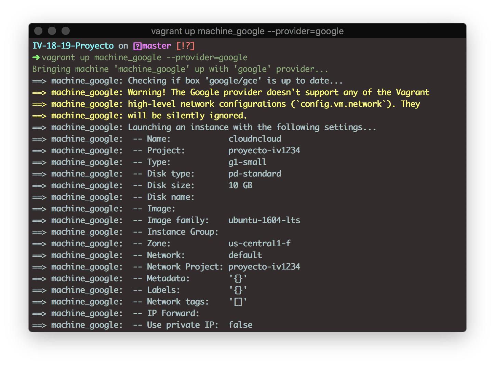
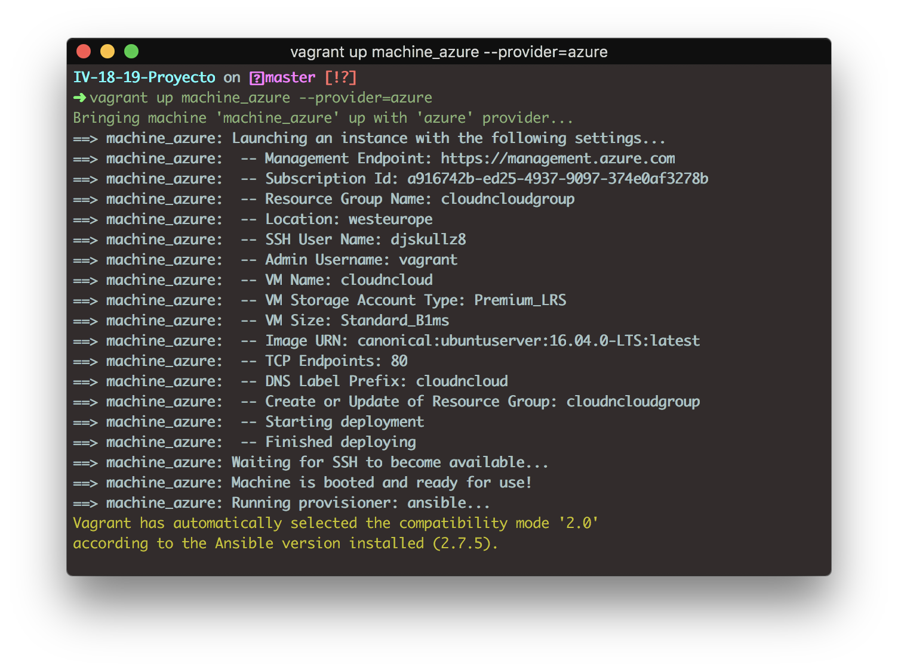

# Despliegue en la nube

## Google

Para realizar el despliegue he seguido el tutorial [siguiente](https://github.com/mitchellh/vagrant-google).

### Configuración de la plataforma

En la plataforma debemos de habilitar Google Compute Engine y crear una cuenta de servicio para el acceso a la API.

Una vez realizado esto, se nos genera un archivo ```private.json``` (contiene información de los credenciales) y nuestro ```Service account key```. Todo esta información la debemos de colocarla en nuestro archivo de configuración de ```Vagrantfile```.

### Configurar el archivo Vagranfile

En primer lugar, antes de configurar el archivo, debemos de instalarnos el plugin de Google para Vagrant.

```bash
vagrant plugin install vagrant-google
```

Creamos un Vagrantfile que tenga el siguiente aspecto y rellenando la información siguiente:

```ruby
Vagrant.configure("2") do |config|
    config.vm.box = "google/gce"

    machine_google.vm.provider :google do |google, override|
        google.google_project_id = ENV['PROJECT_ID']
        google.google_client_email = ENV['CLIENT_EMAIL']
        google.google_json_key_location = ENV['JSON_PRIV_KEY']
        
        google.image_family = 'ubuntu-1604-lts'
        google.name = 'cloudncloud'
        google.machine_type = 'g1-small'
        google.tags = ['vagrantbox', 'dev']
        google.disk_size = 10
        google.disk_name = 'cloudnclouddisk'
        google.disk_type = 'pd-ssd'
        google.network = 'cloudncloudnetwork'
        google.subnetwork = 'cloudncloudsubnetwork'
        google.external_ip = '35.232.122.71'

        override.ssh.username = "djskullz8"
        override.ssh.private_key_path = "~/.ssh/my-ssh-key"
    end
end
```

- PROJECT_ID: es el identificador del proyecto
- CLIENT_EMAIL: es el ```Service account key```.
- JSON_PRIV_KEY: es la localización en donde está ```private.json```.

La función del Vagranfile es describir el tipo de máquina que se va a utilizar, cómo se va a configurar y cómo provisionarla.

En mi caso, indico que voy a utilizar como imagen un Ubuntu 16.04LTS, cuyo nombre es cloudncloud y el tipo de máquina es g1-small. Estás caracteristicas las determino con las respectivas variables: image_family para indicar el sistema operativo a utilizar, name para indicar el nombre de la maquina virtual y machine_type para el tipo de [máquinas que ofrece google](https://cloud.google.com/compute/docs/machine-types). Además de añadir el nombre, la capacidad del disco y el tipo de disco, ```google.disk_name```, ```google.disk_size``` y ```google.disk_type``` respectivamente. Indico el nombre de la red y de la subred (```google.network``` y ```google.subnetwork```). Y por último, establezco la ip pública de mi máquina ```google.external_ip```.

Antes debemos de indicar la dummy box que google utiliza mediante ```config.vm.box = "google/gce"```. Una dummy box, o caja, son el formato de paquete para entornos Vagrant. Cualquiera puede usar una caja en cualquier plataforma que Vagrant admita para crear un entorno de trabajo idéntico. La forma para agregar cajas la podemos obtener del [catálogo](https://app.vagrantup.com/boxes/search) que ofrece Vagrant.

La dummy box que ofrece google es la [siguiente](https://app.vagrantup.com/google/boxes/gce):

```ruby
Vagrant.configure("2") do |config|
  config.vm.box = "google/gce"
  config.vm.box_version = "0.1.0"
end
```

A continuación, proporcionamos nuestro usuario y la dirección de la clave privada para la conexión por SSH, mediante las variables ```override.ssh.username```y ```private_key_path```.

Una vez creado nuestro Vagranfile, la lanzamos:

```bash
vagrant up --provider=google
```



### Características que ofrece

- Arrancar instancias de Google Compute Engine.
- SSH en las instancias.
- Aprovisione las instancias con cualquier aprovisionador Vagrant incorporado.
- Soporte de carpetas sincronizadas a través de la acción rsync de Vagrant.
- Defina configuraciones específicas de zona para que Vagrant pueda administrar máquinas en múltiples zonas.

## Azure

Para el despliegue en Azure he seguido el siguiente [tutorial](https://github.com/Azure/vagrant-azure/blob/v2.0/README.md).

En primer lugar, antes de nada, debemos de instalarnos el plugin de Azure para Vagrant.

```bash
vagrant plugin install vagrant-azure
```

### Crear una aplicacion de Active Directory

- [Instalamos el CLI de Azure](https://docs.microsoft.com/en-us/cli/azure/install-azure-cli?view=azure-cli-latest).
- Lanzamos en la terminal ```az login``` para loguearnos en Azure.
- Ejecutamos ```az ad sp create-for-rbac``` para crear una aplicación de Active Directory de Azure con acceso a Azure Resource Manager para la suscripción actual de Azure.

La salida ```az ad sp create-for-rbac``` debería de tener el siguiente aspecto:

```text
{
  "appId": "XXXXXXXX-XXXX-XXXX-XXXX-XXXXXXXXXXXX",
  "displayName": "some-display-name",
  "name": "http://azure-cli-2017-04-03-15-30-52",
  "password": "XXXXXXXXXXXXXXXXXXXX",
  "tenant": "XXXXXXXX-XXXX-XXXX-XXXX-XXXXXXXXXXXX"
}
```

Los valores ```tenant```, ```appId``` y ```password``` se asignan a los valores de configuración ```azure.tenant_id```, ```azure.client_id``` y ```azure.client_secret``` en su archivo Vagrant. Al igual que en la configuración de la máquina de Google, toda esta información debe de estar en la configuración del Vagrantfile.

Como dummy box utilizamos el ```config.vm.box = azure```.

Resultado del ```Vagrantfile```:

```ruby
Vagrant.configure("2") do |config|
    config.vm.box = 'azure'
    config.vm.network "forwarded_port", guest: 22, host: 2222
    config.vm.network "forwarded_port", guest: 80, host: 8080

    machine_azure.vm.provider :azure do |azure, override|
        azure.tenant_id = ENV['AZURE_TENANT_ID']
        azure.client_id = ENV['AZURE_CLIENT_ID']
        azure.client_secret = ENV['AZURE_CLIENT_SECRET']
        azure.subscription_id = ENV['AZURE_SUBSCRIPTION_ID']

        azure.vm_size = 'Standard_B1ms'
        azure.location = 'westeurope'
        azure.vm_name = 'cloudncloud'
        azure.resource_group_name = 'cloudncloudgroup'
        azure.tcp_endpoints = ['80','22']
        azure.virtual_network_name = 'cloudncloudnetwork'
        azure.dns_name = 'cloudncloud'
        azure.nsg_name = 'cloudncloudnsg'
        azure.subnet_name = 'cloudncloudsubnet'

        override.vm.synced_folder ".", "/vagrant", disable: true
        override.ssh.username = "djskullz8"
        override.ssh.private_key_path = "~/.ssh/my-ssh-key"
    end
end
```

Indicamos a la máquina que los puertos 22 y 80 estan abiertos a través del 2222 y 8080 respectivamente, mediante ```config.vm.network "forwarded_port", guest: port, host: port```. Al igual que en Google, añadimos las siguientes caracteristicas a nuestra máquina de Azure:

- ```azure.vm_size```: Tipo de máquina de Azure. [Lista de máquinas de Azure](https://docs.microsoft.com/en-us/azure/virtual-machines/linux/sizes).
- ```azure.location```: La localización de la máquina en nuestro caso es en West Europe.
- ```azure.vm_name```: nombre de la maquina virtual.
- ```azure.resource_group_name```: nombre del grupo de recurso.
- ```azure.tcp_endpoints```:  las reglas de seguridad de entrada personalizadas forman parte del grupo de seguridad de la red (también conocidos como tcp endpoints, en mi caso el puerto 80 y 22.
- ```azure.virtual_network_name```: nombre del recurso de red virtual.
- ```azure.dns_name```: prefijo de Etiqueta DNS.
- ```azure.nsg_name```: prefijo de etiqueta de grupo de seguridad de red
- ```azure.subnet_name```: nombre del recurso de subred de red virtual.

Por último, indico que se sincronicen la carpeta actual con la de destino, mediante ```override.vm.synced_folder "origen", "destino", disable: true```.

Lo mismo que antes, indicamos el usuario y la dirección de la clave privada de SSH.

Una vez mas, la lanzamos:

```bash
vagrant up --provider=azure
```



### Nota

En la configuración establezco el tiempo en segundos que Vagrant esperará a que las máquinas arranquen y sean accesibles. Mediante la variable ```config.vm.boot_timeout = 300```(s).

En el Vagrantfile he añadido la posibilidad de trabajar con dos máquinas (Google, Azure) que se llaman *machine_google* y *machine_azure*. Las ordenes son las siguientes:

#### Para iniciar las VM

```bash
vagrant up
```

ó

```bash
vagrant up machine_google
vagrant up machine_azure
```

#### Para conectar ssh

```bash
vagrant ssh machine_google
vagrant ssh machine_azure
```

#### Para apagar las VM

```bash
vagrant halt
```

ó

```bash
vagrant halt machine_google
vagrant halt machine_azure
```


Para poder llevar acabo que Vagrant pueda llevar [multiples máquinas](https://www.vagrantup.com/docs/multi-machine/), he realizado lo siguiente:

```ruby
    config.vm.define :machine_google do |machine_google|
        ...
    end

    config.vm.define :machine_azure do |machine_azure|
        ...
    end
```

Cuando se introduce machine_google (ó machine_azure) directamente se ejecutan las sentencias que están dentro de la definición.

## Provisionamiento

Para el provisionamiento he utilizado Ansible, que se trata de una herramienta para provisionar la máquina virtual.

La orden de provisionamiento la realizo al final del Vagrantfile:

```ruby
config.vm.provision :ansible do |ansible|
    ansible.playbook = "provision/playbook.yml"
end
```

La idea del archivo ```playbook.yml``` es automatizar la instalación de los paquetes en nuestra máquinas, en mi caso le añado reglas para que realice la actualizacion del sistema operativo, la instalación de paquetes necesarios (pip2, pip3, Git y PostgresSQL),la clonación de mi repositorio, sincronización de la carpeta actual, la creación del usuario y de la base de datos para mi aplicación, y la instalación de los paquetes del [```requirements.txt```](../requirements.txt).  Y todo ello se realiza cuando creamos por primera vez nuestra máquina virtual.

```ansible
- hosts: all
  remote_user: djskullz8
  tasks:
    - name: Update and upgrade apt packages
      become: true
      apt:
        upgrade: yes
        update_cache: yes

    - name: Instalar pip2, pip3, Git y PostgresSQL
      become: true
      apt:
        name: "{{ packages }}"
      vars:
        packages:
        - python-pip
        - python3-pip
        - git
        - postgresql
        - postgresql-contrib

    - name: Clone a private repository into IV-18-19-Proyecto
      git:
        repo: https://github.com/Thejokeri/IV-18-19-Proyecto.git
        version: master
        dest: IV-18-19-Proyecto/
      become: no

    - name: Sincronizando la carpeta local
      synchronize:
        src: /Users/thejoker/Documents/Facultad/1ºSemestre/IV/IV-18-19-Proyecto/bd
        dest: .

    - name: Instalar requirements.txt
      become: true
      command: pip install -r ./IV-18-19-Proyecto/requirements.txt

    - name: Crear usuario postgres "{{ lookup('env','USER') }}"
      become: yes
      become_user: postgres
      postgresql_user:
        name: "{{ lookup('env','USER') }}"
        password: "{{ lookup('env','PASS') }}"

    - name: Crear la base de datos PDFdb
      become: yes
      become_user: postgres
      postgresql_db:
        name: pdfdb
        owner: "{{ lookup('env','USER') }}"
```

A su vez, tambien podemos provisionar nuestra máquina en cualquier momento con las siguientes ordenes:

```bash
vagrant provision
```

ó

```bash
vagrant provision machine_google
vagrant provision machine_azure
```

## Despliegue

Para el despliegue del microservicio he usado Fabric, que se trata de una herramienta para el despliegue en las maquinas virtuales.

En el [fabfile.py](../despliegue/fabfile.py) he creado las siguientes funciones:

- Instalar: Clona el repositorio e instala los [requirements.txt](../requirements.txt).

- Borrar: Elimina la carpeta del repositorio.

- Actualizar: Comprueba si existe la carpeta del repositorio. En caso afirmativo, realiza un git pull, instala las dependencias del [requirements.txt](../requirements.txt) y actualiza el pip.

- Iniciar: Comprueba si existe la carpeta del repositorio e inicia la aplicación que escuche en el puerto 80.

- ShowStatus: Muestra, mediante un curl, el STATUS de la aplicación.

- Parar: Elimina el proceso que está ejecutando la aplicación.

Orden para desplegar en la máquina de Azure:

```bash
fab -f despliegue/fabfile.py -H djskullz8@23.97.177.83 <Funciones>
```

Orden para desplegar en la máquina de Google:

```bash
fab -f despliegue/fabfile.py -H djskullz8@35.225.49.80 <Funciones>
```

Enlaces de interés

- [Overview and Tutorial](http://docs.fabfile.org/en/1.14/tutorial.html).
- [How To Use Fabric To Automate Administration Tasks And Deployments](https://www.digitalocean.com/community/tutorials/how-to-use-fabric-to-automate-administration-tasks-and-deployments).
- [Using Ansible to Set Up PostgreSQL](https://blog.apcelent.com/using-ansible-to-set-up-postgresql.html).