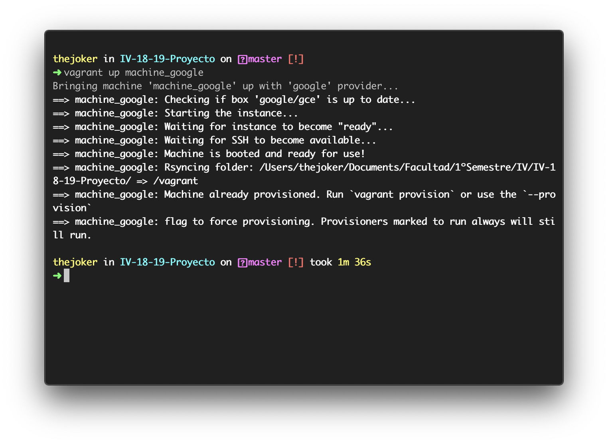
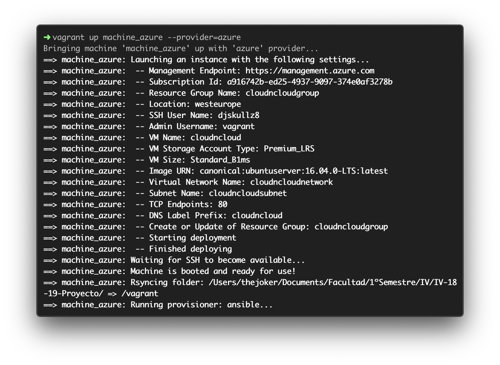

# Despliegue en la nube

## Google

Para realizar el despliegue he seguido el tutorial [siguiente](https://github.com/mitchellh/vagrant-google).

### Configuración de la plataforma

En la plataforma debemos de habilitar Google Compute Engine y crear una cuenta de servicio para el acceso a la API.

Una vez realizado esto, se nos genera un archivo ```private.json``` (contiene información de los credenciales) y nuestro ```Service account key```. Todo esta información la debemos de colocarla en nuestro archivo de configuración de ```Vagrantfile```.

### Configurar el archivo Vagranfile

En primer lugar, antes de configurar el archivo, debemos de instalarnos el plugin de Google para Vagrant.

```bash
vagrant plugin install vagrant-google
```

Creamos un Vagrantfile que tenga el siguiente aspecto y rellenando la información siguiente:

```ruby
Vagrant.configure("2") do |config|
    config.vm.box = "google/gce"
    config.vm.network "private_network", guest: 80, host: 80

    machine_google.vm.provider :google do |google, override|
        google.google_project_id = ENV['PROJECT_ID']
        google.google_client_email = ENV['CLIENT_EMAIL']
        google.google_json_key_location = ENV['JSON_PRIV_KEY']
        
        google.image_family = 'ubuntu-1604-lts'
        google.name = 'cloudncloud'
        google.machine_type = 'g1-small'

        override.ssh.username = "djskullz8"
        override.ssh.private_key_path = "~/.ssh/my-ssh-key"
    end
end
```

- PROJECT_ID: es el identificador del proyecto
- CLIENT_EMAIL: es el ```Service account key```.
- JSON_PRIV_KEY: es la localización en donde está ```private.json```.

La función del Vagranfile es describir el tipo de máquina que se va a utilizar, cómo se va a configurar y cómo provisionarla.
En mi caso, indico que voy a utilizar como imagen un Ubuntu 16.04LTS, cuyo nombre es cloudncloud y el tipo de máquina es g1-small.

Una vez creado nuestro Vagranfile, la lanzamos:

```bash
vagrant up --provider=google
```



### Características que ofrece

- Arrancar instancias de Google Compute Engine.
- SSH en las instancias.
- Aprovisione las instancias con cualquier aprovisionador Vagrant incorporado.
- Soporte de carpetas sincronizadas a través de la acción rsync de Vagrant.
- Defina configuraciones específicas de zona para que Vagrant pueda administrar máquinas en múltiples zonas.

## Azure

Para el despliegue en Azure he seguido el siguiente [tutorial](https://github.com/Azure/vagrant-azure/blob/v2.0/README.md).

En primer lugar, antes de nada, debemos de instalarnos el plugin de Azure para Vagrant.

```bash
vagrant plugin install vagrant-azure
```

### Crear una aplicacion de Active Directory

- [Instalamos el CLI de Azure](https://docs.microsoft.com/en-us/cli/azure/install-azure-cli?view=azure-cli-latest).
- Lanzamos en la terminal ```az login``` para loguearnos en Azure.
- Ejecutamos ```az ad sp create-for-rbac``` para crear una aplicación de Active Directory de Azure con acceso a Azure Resource Manager para la suscripción actual de Azure.

La salida ```az ad sp create-for-rbac``` debería de tener el siguiente aspecto:

```text
{
  "appId": "XXXXXXXX-XXXX-XXXX-XXXX-XXXXXXXXXXXX",
  "displayName": "some-display-name",
  "name": "http://azure-cli-2017-04-03-15-30-52",
  "password": "XXXXXXXXXXXXXXXXXXXX",
  "tenant": "XXXXXXXX-XXXX-XXXX-XXXX-XXXXXXXXXXXX"
}
```

Los valores ```tenant```, ```appId``` y ```password``` se asignan a los valores de configuración ```azure.tenant_id```, ```azure.client_id``` y ```azure.client_secret``` en su archivo Vagrant.

Resultado del ```Vagrantfile```:

```ruby
Vagrant.configure("2") do |config|
    config.vm.box = 'azure'

    machine_azure.vm.provider :azure do |azure, override|
        azure.tenant_id = ENV['AZURE_TENANT_ID']
        azure.client_id = ENV['AZURE_CLIENT_ID']
        azure.client_secret = ENV['AZURE_CLIENT_SECRET']
        azure.subscription_id = ENV['AZURE_SUBSCRIPTION_ID']

        azure.vm_size = 'Standard_B1ms'
        azure.location = 'westeurope'
        azure.vm_name = 'cloudncloud'
        azure.resource_group_name= 'cloudncloudgroup'
        azure.tcp_endpoints = '80'

        override.ssh.username = "djskullz8"
        override.ssh.private_key_path = "~/.ssh/my-ssh-key"
    end
end
```

Una vez mas, la lanzamos:

```bash
vagrant up --provider=azure
```



### Nota

En el Vagrantfile he añadido la posibilidad de trabajar con dos máquinas (Google, Azure) que se llaman *machine_google* y *machine_azure*. Las ordenes son las siguientes:

### Para iniciar las VM

```bash
vagrant up
```

ó

```bash
vagrant up machine_google
vagrant up machine_azure
```

### Para conectar ssh

```bash
vagrant ssh machine_google
vagrant ssh machine_azure
```

### Para apagar las VM

```bash
vagrant halt
```

ó

```bash
vagrant halt machine_google
vagrant halt machine_azure
```

Para poder llevar acabo que Vagrant pueda llevar [multiples máquinas](https://www.vagrantup.com/docs/multi-machine/), he realizado lo siguiente:

```ruby
    config.vm.define :machine_google do |machine_google|
        ...
    end

    config.vm.define :machine_azure do |machine_azure|
        ...
    end
```

Cuando se introduce machine_google (ó machine_azure) directamente se ejecutan las sentencias que están dentro de la definición.

## Provisionamiento

Para el provisionamiento he utilizado Ansible, que se trata de una herramienta para provisionar la máquina virtual.

La orden de provisionamiento la realizo al final del Vagrantfile:

```ruby
config.vm.provision :ansible do |ansible|
    ansible.playbook = "provision/playbook.yml"
end
```

La idea del archivo ```playbook.yml``` es automatizar la instalación de los paquetes en nuestra máquinas, en mi caso le añado reglas para que realice la actualizacion del sistema operativo, la clonación de mi repositorio, y la instalación de los paquetes del [```requirements.txt```](../requirements.txt) (para más [info](../provision/playbook.yml)). Y todo ello se realiza cuando creamos por primera vez nuestra máquina virtual.

A su vez, tambien podemos provisionar nuestra máquina en cualquier momento con las siguientes ordenes:

```bash
vagrant provision
```

ó

```bash
vagrant provision machine_google
vagrant provision machine_azure
```

## Despliegue

Para el despliegue del microservicio he usado Fabric, que se trata de una herramienta para el despliegue en las maquinas virtuales.

En el [fabfile.py](../despliegue/fabfile.py) he creado las siguientes funciones:

- Instalar: Clona el repositorio e instala los [requirements.txt](../requirements.txt).

- Borrar: Elimina la carpeta del repositorio.

- Actualizar: Comprueba si existe la carpeta del repositorio. En caso afirmativo, realiza un git pull, instala las dependencias del [requirements.txt](../requirements.txt) y actualiza el pip.

- Iniciar: Comprueba si existe la carpeta del repositorio e inicia la aplicación que escuche en el puerto 80.

- ShowStatus: Muestra, mediante un curl, el STATUS de la aplicación.

- Parar: Elimina el proceso que está ejecutando la aplicación.

Orden para desplegar en la máquina de Azure:

```bash
fab -f despliegue/fabfile.py -H djskullz8@23.97.177.83 <Funciones>
```

Orden para desplegar en la máquina de Google:

```bash
fab -f despliegue/fabfile.py -H djskullz8@35.225.49.80 <Funciones>
```

Enlaces de interés

- [Overview and Tutorial](http://docs.fabfile.org/en/1.14/tutorial.html).
- [How To Use Fabric To Automate Administration Tasks And Deployments](https://www.digitalocean.com/community/tutorials/how-to-use-fabric-to-automate-administration-tasks-and-deployments).