# Contenedores

## Docker

En primer lugar vamos a seguir los siguientes pasos para llevar el despliegue de nuestra aplicación en Docker. Para ello debemos de instalar Docker.

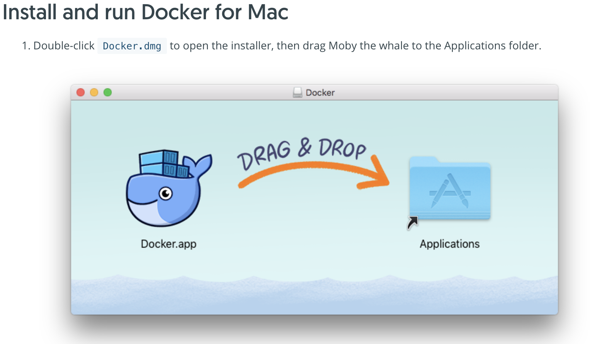


Una vez instalado debemos de registrarnos en nuestra cuenta de Docker.

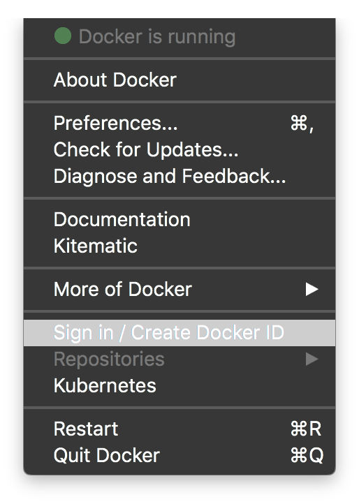

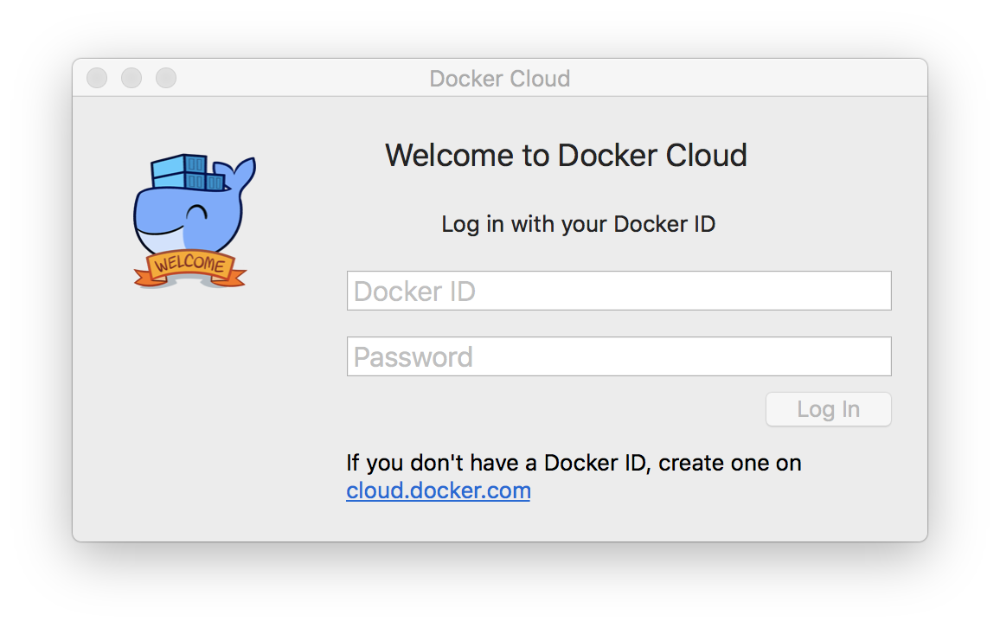

### Configurar el despliegue

Ahora vamos a vincular nuestra cuenta de GitHub con Docker, para ello vamos a **Profile > Settings > Linked Accounts & Services** y seleccionamos **Link to GitHub**

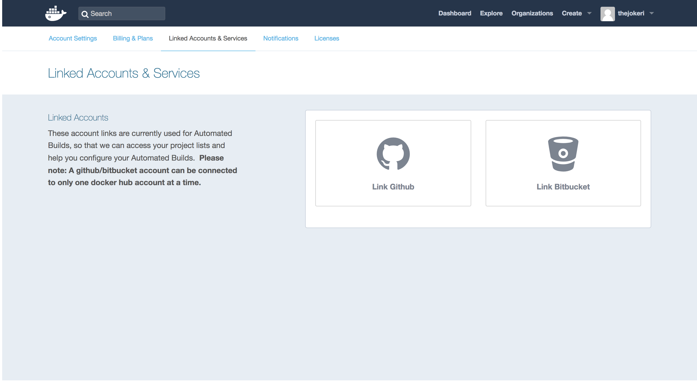

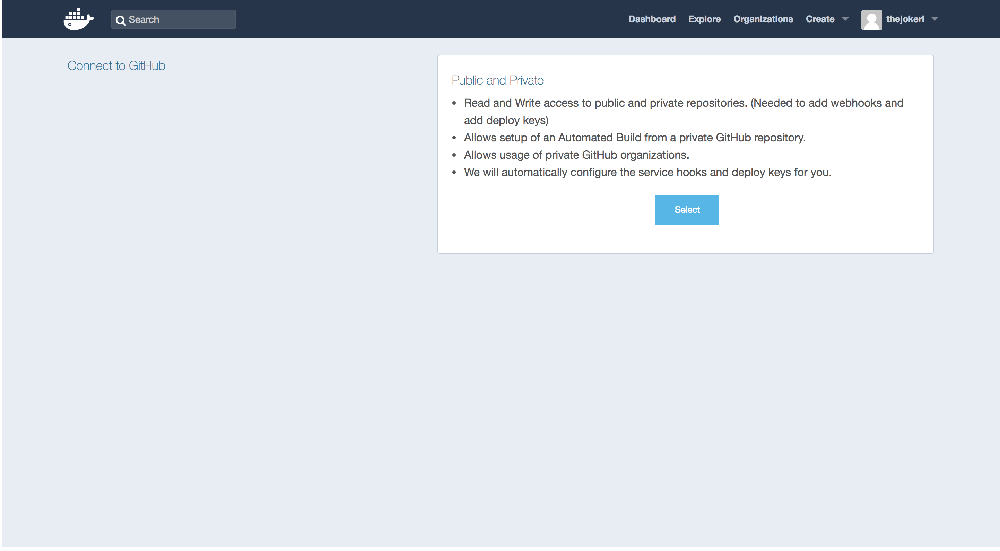

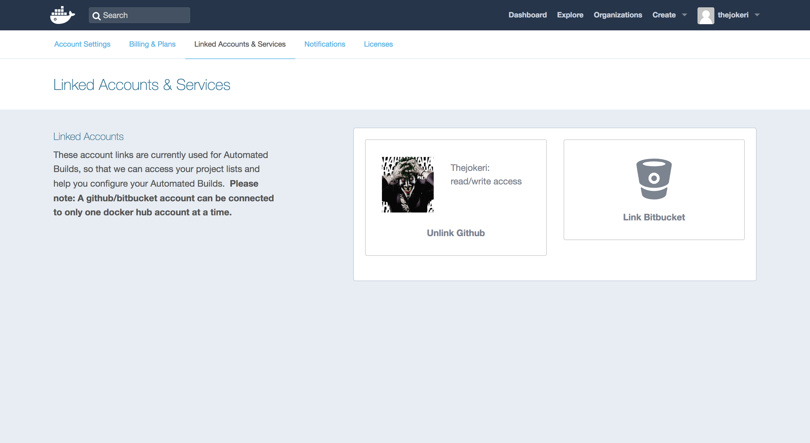

### Configurar el despliegue automático

Una vez que tenemos enlazada nuestra cuenta de GitHub con Docker, procedemos a realizar **Create Automated Build.**

Para ello, vamos a la pestaña de **Create** seleccionamos **Create Automated Build**.

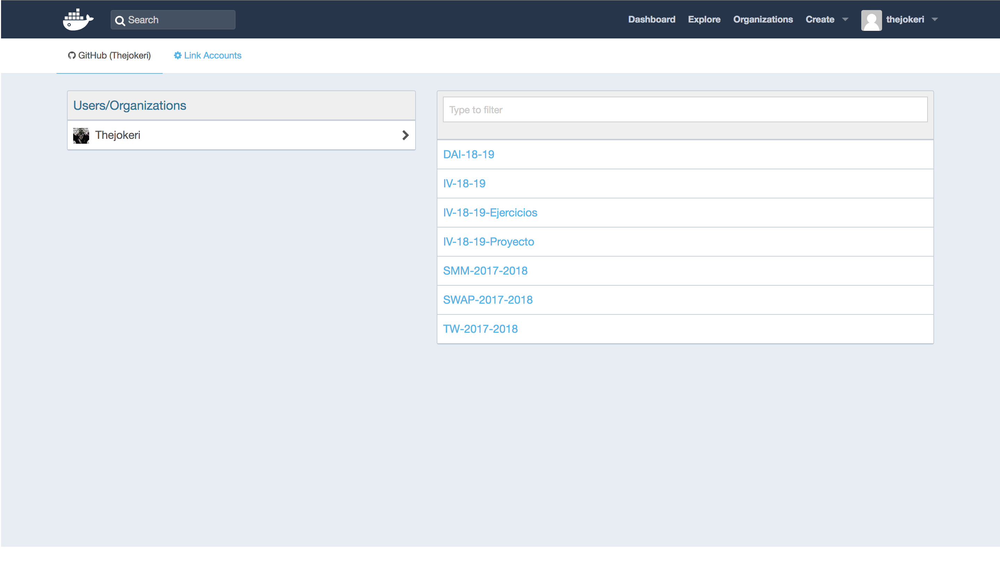

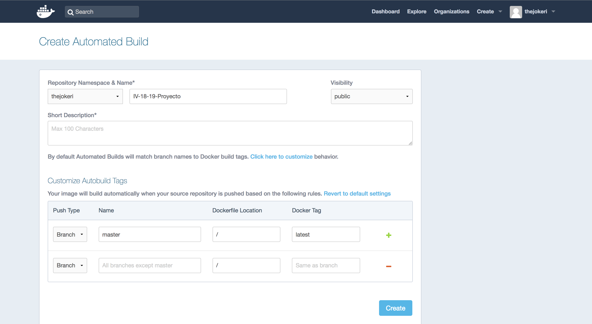

Quedando finalmente:

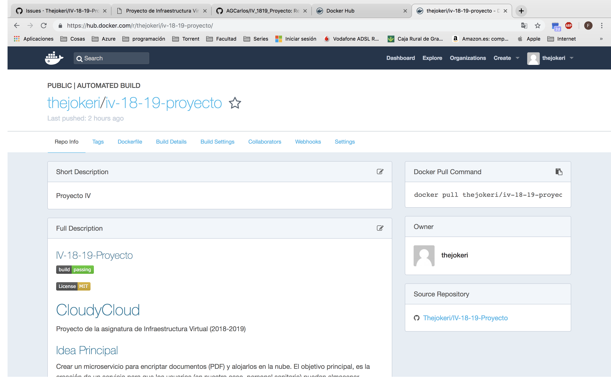

### Despliegue en Docker

Una vez que tenemos todo configurado procedemos al despliegue. [Enlace para más información.](https://docs.docker.com/get-started/#docker-concepts)

En primer lugar, para definir el contenedor debemos de  crear el archivo que lo define, que es ```Dockerfile```.

El archivo ```Dockerfile``` se encarga de definir el contenedor, todos los recursos, las interfaces de red, las unidades de disco, etc. Y todo ello virtualizado y ajeno del resto del sistema. En el fichero se especifica los archivos que se desean "copiar en" ese contenedor y el modo de ejecución.

Contenido del ```Dockerfile```:

```text
# Use an official Python runtime as a parent image
FROM python:3.6

# Set the working directory to /app
WORKDIR /app

# Copy the current directory contents into the container at /app
COPY . /app

# Install any needed packages specified in requirements.txt
RUN pip install -r requirements.txt

# Make port 80 available to the world outside this container
EXPOSE 80

# Define environment variable
ENV NAME cloudncloud

# Run app.py when the container launches
CMD ["python", "app.py"]
```

Ahora nuestro contenedor ya está definido, ahora va a descargar todas las dependencias del archivo ```requirements.txt``` y va a ejecutar ```app.py```.

Ya tenemos el Docker Hub configurado para que automaticamente tome los archivos del repositorio y vaya actualizando nuestra imagen.

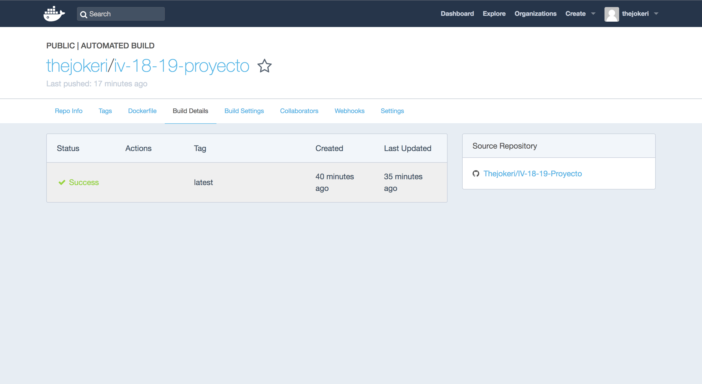

- Contenedor: [Aplicación en DockerHub.](https://hub.docker.com/r/thejokeri/iv-18-19-proyecto/)

Para descargar y lanzar el contenedor introducimos:

```bash
    docker pull thejokeri/iv-18-19-proyecto
    docker run -p 4000:80 thejokeri/iv-18-19-proyecto:version1.1-reduce
```

## Despliegue del contenedor en Heroku

Vamos a especificar a Heroku que se trata de un contenedor. Para ello, vamos a crear el archivo heroku.yml que va contener la información de cómo se debe de construir el contenedor y cómo ejecutarse desde el ```Dockerfile```.

Archivo **heroku.yml**:

```text
build:
  docker:
    web: Dockerfile
run:
  web: gunicorn API_WEB:app --log-file -
```

Después de ésto, vamos a introducir los siguientes comandos para realizar el despliegue en heroku (Debemos de estar logueados en Heroku y en Docker):

Ahora podemos registrarnos en el Registro del contenedor

```bash
heroku container:login
```

Construimos el ```Dockerfile```en el directorio actual y hacemos push a la imagen.

```bash
heroku container:push web
```

Lanzamos la nueva imagen a despliegue.

```bash
heroku container:release web
```

Una vez que esta subida la imagen, mostramos la información de la aplicación:

```bash
heroku apps:info -a cloudncloud
```

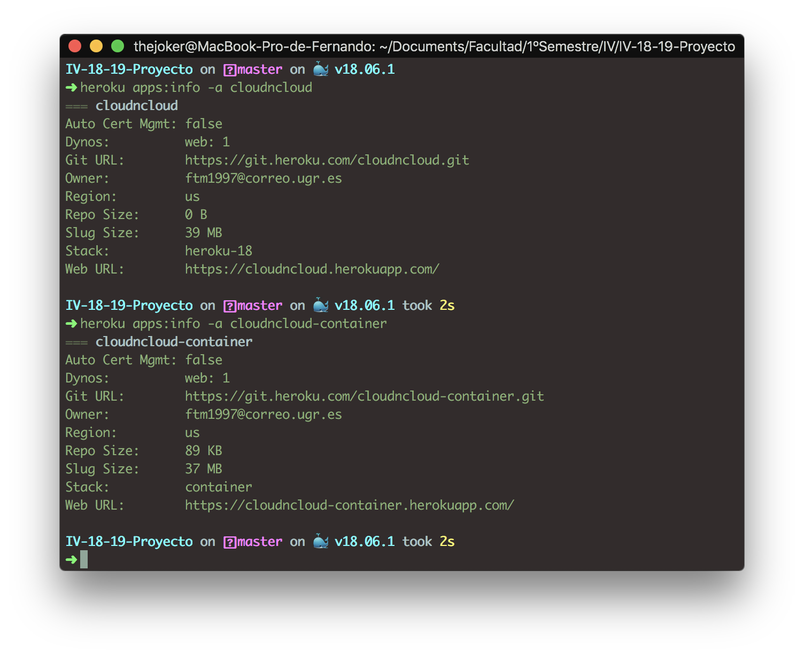

---

## Zeit

Para desplegar en Zeit vamos a instalarnos Now para nuestra máquina. [Enlace de descarga](https://zeit.co/download)

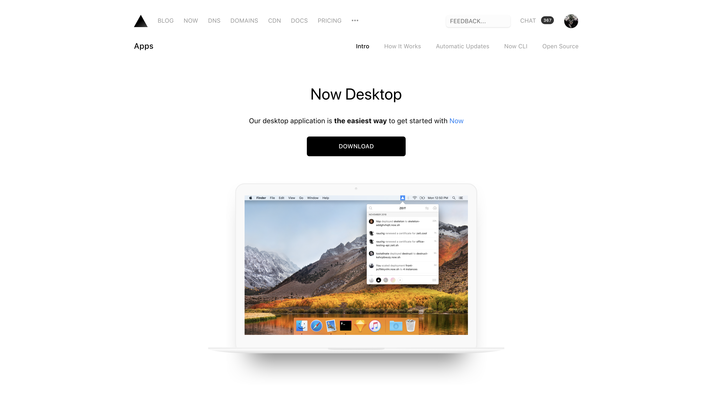

Una vez que tenemos descargado Zeit, introducimos el siguiente comando:

```bash
    sudo now --public
```

Ya nos genera el enlace del despliegue.

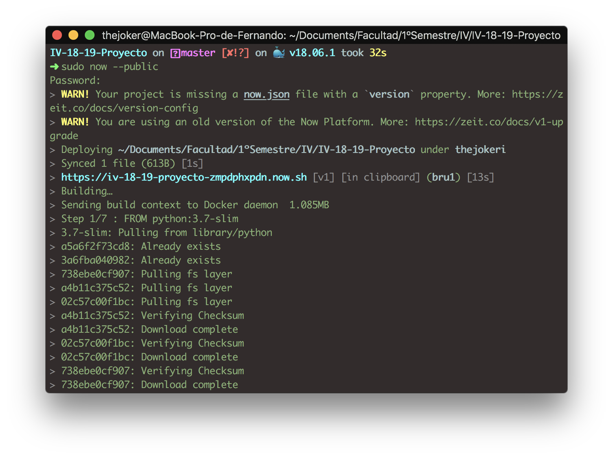

Necesitamos crear el siguiente archivo ```now.json```.

```text
{
    "features": {
    "cloud": "v1"
    }
  }
```

Se trata de un archivo de configuración que tiene las instrucciones de cómo construir y desplegar.

### Despliegue en Zeit

- Contenedor: [Aplicación en Zeit](https://iv-18-19-proyecto-zmpdphxpdn.now.sh/)