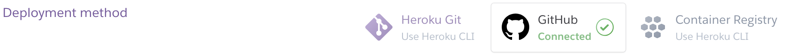
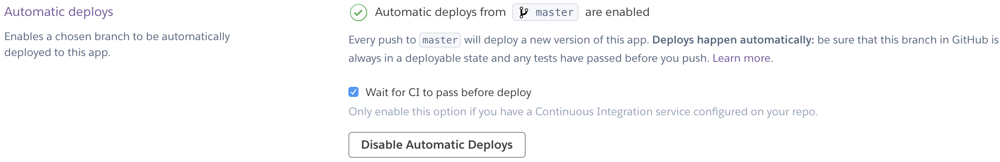

# Despliegue de la aplicación

## Configurar el despliegue con Heroku

Para el despliegue de la aplicación he utilizado Heroku y he seguido este [tutorial](https://github.com/datademofun/heroku-basic-flask) para realizar el despliegue.

El [tutorial](https://github.com/datademofun/heroku-basic-flask), está centrado en desplegar una aplicación en Flask en la nube a través de Heroku.

Los pasos son los siguientes (aunque aconsejo seguir el tutorial ya que la explicación está más detallada):

1. Nos registramos en Heroku.

    - [Sing up to Heroku](https://signup.heroku.com/)

2. Nos descargamos el toolbelt de Heroku (Mac OS, Windows y Ubuntu 16).

    - [Toolbelt](https://toolbelt.heroku.com)

3. En la terminal nos autenticamos con:

    ```bash
    heroku login
    ```

4. Creamos nuestra aplicación Flask, esta debe de llamarse **app.py**

5. Especificamos la dependencias que requiera nuestra aplicación ```requirements.txt```.

6. [Instalamos](https://devcenter.heroku.com/articles/python-gunicorn) gunicorn web server y lo añadimos a nuestro archivo ```requirements.txt```.

7. Indicamos nuestra versión de python que va a ejecutar la **app.py** en el archivo ```runtime.txt```.

8. Creamos un Procfile, que es un archivo de texto plano, en el cual, indicamos a Heroku cómo poner en marcha nuestra wep app. Este archivo se debe de llamar Procfile.

    ```text
    web: gunicorn app:app --log-file=-
    ```
    Un Procfile es un archivo de texto en el directorio raíz de su aplicación que define los tipos de proceso y declara explícitamente qué comando debe ejecutarse para iniciar su aplicación.

9. Inicializar la aplicación de Heroku.

    ```bash
    heroku create
    ```
    Crea una aplicación con un nombre aleatorio, si deseamos que tenga un nombre se lo indicamos con el siguiente comando:

    ```bash
        heroku create nombre
    ```

10. Y por último, desplegar el código de nuestra aplicación:

    - Rama de Heroku:

    ```bash
        git push heroku master
    ```

    - Cuenta de Github:

    ```bash
        git push origin master
    ```

## Configurar el despliegue automático

Para configurar el despliegue automático en Heroku, debemos entrar en nuestra cuenta y vincularla con nuestra cuenta de Github.

Para ello:

1. Entramos en la pestaña **Deploy** de nuestra app.

    

2. En el aparatado de **Deployment method**, seleccionamos Github.

    

3. Una vez que estan vinculados, nos vamos al apartado de **Automatic deploys**.

    - [x] Wait for CI to pass before deploy.
    - Pulsamos el botón: **Enable Automatic deploys**.

    

Resultado:

- [Aplicación de Heroku](https://cloudncloud.herokuapp.com/)